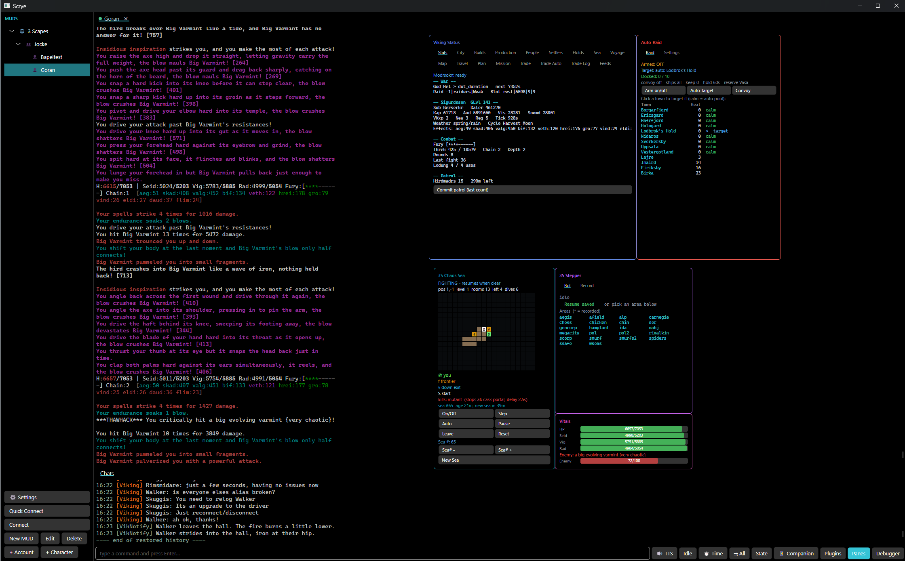
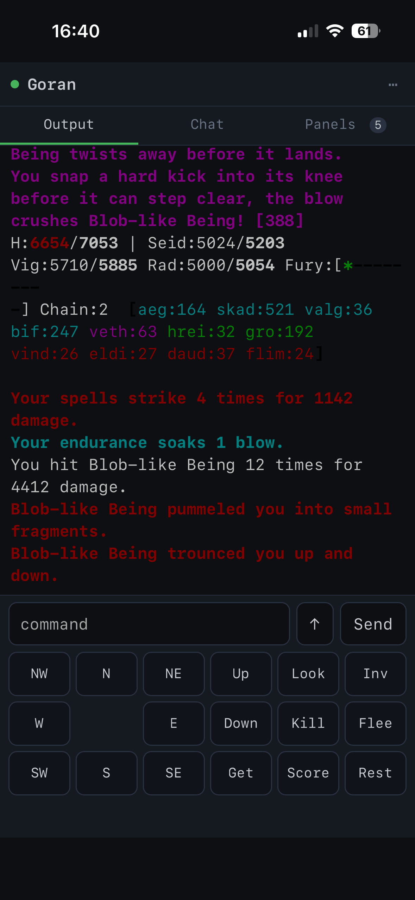
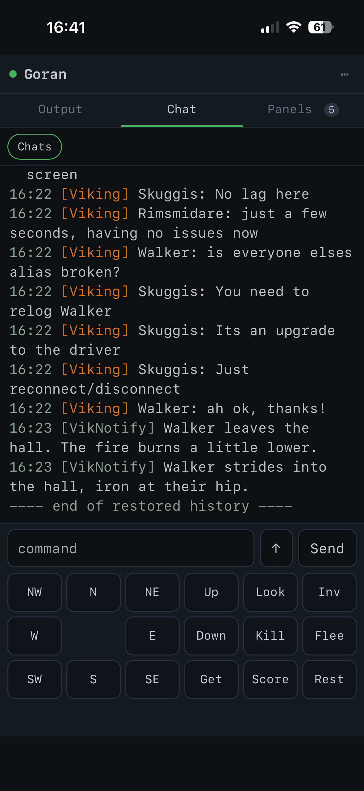
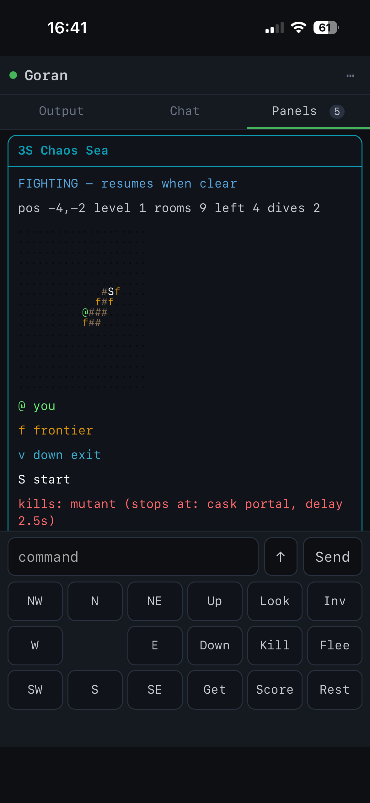

# Scrye

A modern MUD client in the spirit of MUSHclient, built in C# / .NET with an [Avalonia](https://avaloniaui.net/) UI.

Scrye is *inspired by* MUSHclient but does **not** aim for binary or plugin compatibility with it. It reimagines the client for today: Unicode-native, GMCP-first, async, and testable, with a redesigned scripting and plugin model.

## Screenshots



A live session on 3Scapes. Output on the left; on the right, HUD panels drawn by plugins —
Viking Status with its tab strip, an auto-raid controller, a chaos-sea map, an area stepper
and vitals bars. Along the bottom, a **capture pane** collecting every chat channel so it
can't scroll away, and the toggle bar for timestamps, TTS, the idle guard and the rest.

### On your phone

The **mobile companion** serves the same live session to a browser on your phone. The desktop
keeps the connection, runs the triggers and drives the plugins; the phone is another view of
it, so you can close it and pick up an hour later where you left off.

| Output | Chat | HUD panels |
|:--:|:--:|:--:|
|  |  |  |
| Full colour, and the prompt as the MUD sends it | Your capture panes, kept separate from the main stream | The same plugin panels, rendered for the phone |

## Download

**[Latest release](../../releases/latest)** — self-contained builds for Windows and Linux. Nothing to install: no .NET, no runtime. Unzip and run.

| Platform | File | Then |
|---|---|---|
| Windows 10/11 (x64) | `Scrye-<version>-win-x64.zip` | Unzip, run `Scrye.App.exe` |
| Linux (x64) | `Scrye-<version>-linux-x64.tar.gz` | `tar -xzf` it, run `./Scrye.App` |

The Windows build is unsigned, so first launch shows SmartScreen's "Windows protected your PC" — **More info → Run anyway**. `SHA256SUMS.txt` is attached to every release if you'd rather verify than trust. macOS isn't released; see [platforms](#build--run) below.

Building from source is only necessary if you want to change something — see **Build & run**.

## Documentation

- **[docs/Scrye-Guide.md](docs/Scrye-Guide.md)** — the manual. Connecting, triggers, aliases,
  timers, sequences, profiles, capture panes, logging, the script console, and a full plugin
  authoring reference.
- **[docs/Scrye-Companion-Setup.md](docs/Scrye-Companion-Setup.md)** — reaching Scrye from your phone.
- **[docs/Scrye-Companion-Design.md](docs/Scrye-Companion-Design.md)** — how the mobile companion works, and why.

If you only read one, read the guide — it assumes no prior MUSHclient knowledge.

Also in `docs/`, for anyone working *on* Scrye rather than with it: [the plugin colour
system](docs/Plugin-Color-System.md) (the validated accents and how they were checked),
[the wasm plugin ABI](docs/scrye-wasm-abi.md), a [command-surface audit](docs/Command-Surface-Audit.md),
[known gaps](docs/Backlog.md), and two design/planning records —
[the KeraLua migration](docs/Plan-KeraLua-Migration.md) and [wasm plugins](docs/Plan-Wasm-Plugins.md).
**Those last two are working documents written before the work landed**, kept for the reasoning
rather than as a description of the code today; each carries a status header saying what actually
shipped.

## Status

Scrye is a working client in daily use on [3Scapes](https://www.3scapes.org/). Connecting, automation, scripting, plugins, HUD panels and profiles are all implemented and exercised in real play — not scaffolding.

What's there today:

- **Connection** — TCP with TLS, telnet negotiation, MCCP compression, automatic reconnect with backoff, and optional auto-login.
- **Protocols** — ANSI (16 / 256 / truecolour), MXP with clickable command links, GMCP, MSP sound, and MIP.
- **Multi-world** — several worlds connected at once as tabs, each with its own scrollback, automation and plugins. Optionally broadcast a command to all of them.
- **Automation** — triggers (plain or regex), aliases, timers, sequences, highlights, and keyboard macros, with an event debugger and a state inspector for working out why a rule did or didn't fire.
- **Profiles** — a four-layer cascade (Global → MUD → Account → Character). Single values take the deepest layer that sets them; collections merge across layers.
- **Scripting** — a Lua console (`/…` in the command line) and a `world.*` API, running on the session loop so ordering stays deterministic.
- **Plugins** — Lua and JavaScript plugins with a manifest, per-character opt-in, live reload, persistent per-world storage, and declarative HUD panels.
- **Output** — a virtualized renderer, find-in-scrollback, tab completion from seen words, command history, capture panes for routed lines (chat, tells), session logging, and recording/replay.
- **Appearance** — themes, a monospace-only font picker with live preview, and a choice between the modern xterm and classic MUSHclient ANSI palettes.
- **Text-to-speech** for incoming output (Windows only at runtime).

## Architecture

A strict engine/UI split, a staged receive pipeline (bytes → telnet → decode → ANSI/MXP → styled line), a single-threaded session loop for deterministic trigger and script ordering, and batched output to the UI thread.

| Project | What it is |
|---|---|
| `Scrye.PluginContracts` | The plugin-facing contract: the `IPluginHost` API surface, declarative `PanelSpec` widgets, the semantic theme-token vocabulary, the manifest schema, and the plugin API version. No NuGet, no engine — a plugin can reference this alone. |
| `Scrye.Core` | The UI-free engine: connection, telnet, MCCP, ANSI/MXP parsing, automation, state store, profiles, plugins host, logging, replay. Depends only on the base framework and `Scrye.PluginContracts` — **no NuGet references**. |
| `Scrye.Scripting` | The Lua host (native Lua 5.4 via KeraLua), the JavaScript host (Jint), the WebAssembly host (Wasmtime), the `world.*` facade, and the plugin manager. |
| `Scrye.App` | The Avalonia MVVM UI: world tabs, output view, HUD panels, settings, profile tree, debugger. |
| `Scrye.Cli` | A dependency-free harness; `--selftest` runs canned bytes through the telnet + ANSI pipeline and prints the parsed lines. |
| `Scrye.Companion.Protocol` | The mobile-companion wire contract: message DTOs, batching and JSON config. References `Scrye.Core` only — no NuGet. |
| `Scrye.Companion.Server` | Kestrel + WebSocket host running inside `Scrye.App`, plus the PWA client and Web Push. Kestrel comes from the shared framework — no NuGet. |
| `Scrye.Core.Tests` | xUnit tests over the engine — parser, telnet, automation, highlights, profiles, state store, MIP, plugins, sequences, replay, logging, reconnect. |

`Scrye.Core` staying NuGet-free is deliberate: it keeps the engine portable and makes it cheap to host somewhere other than the desktop app.

`Scrye.PluginContracts` is split out for a related reason: the plugin API should be referenceable
without dragging in the engine. Today nothing needs that — script plugins are text files and
reference no assembly at all — but the boundary is what keeps the API honest. If a type can't
live in an assembly that knows nothing about disk, sessions or Avalonia, it isn't part of the
contract. The namespace stays `Scrye.Core.Plugins`: this is an assembly boundary, not a rename,
so nothing else in the solution had to change.

## Build & run

Requires the **.NET 10 SDK**. First build restores NuGet packages (Avalonia 12, KeraLua, Jint, Wasmtime, xUnit).

```
dotnet build
dotnet test                                          # engine tests
dotnet run --project src/Scrye.Cli -- --selftest     # offline pipeline demo
dotnet run --project src/Scrye.App                   # the GUI
```

To produce a self-contained build packed for sharing:

```
./publish-win.ps1                    # Windows x64 (default) -> dist/Scrye-win-x64.zip
./publish-win.ps1 -Rid linux-x64     # Linux x64            -> dist/Scrye-linux-x64.tar.gz
./publish-win.ps1 -Rid win-arm64     # any RID with a matching .pubxml
```

The recipient needs nothing installed. On Windows they unzip and run `Scrye.App.exe`; unsigned builds show a SmartScreen warning on first launch. On Linux they extract and `chmod +x Scrye.App` first — NTFS has no executable bit, so nothing packed on Windows carries one.

That script is for handing a build to someone directly. **Releases are automated**: pushing a `v*` tag runs `.github/workflows/release.yml`, which publishes each platform *on* that platform (so the Linux tarball keeps its executable bit and needs no `chmod`), attaches the archives and their SHA-256 sums to a draft GitHub Release, and takes its install instructions from `.github/release-body.md`.

**A note on platforms.** The engine and the Avalonia UI are cross-platform by construction. Sound works everywhere (winmm on Windows, `afplay` on macOS, `paplay`/`aplay` on Linux), and auto-login passwords are stored in the OS credential store on Windows (Credential Manager) and Linux (the Secret Service — GNOME Keyring or KWallet — via `secret-tool` from `libsecret-tools`). **Text-to-speech is still Windows-only**, guarded so it declines rather than crashes; so is password storage on **macOS**, where it is not implemented. Saving a password that cannot be stored says so rather than failing quietly at the next login.

- **Windows** is the primary platform: developed, built and played on daily.
- **Linux** works. The `linux-x64` self-contained build has been run on Ubuntu and renders identically to Windows, fonts included. It is smoke-tested when something platform-sensitive changes, not on every commit, so treat it as working-but-lightly-exercised.
- **macOS** compiles (CI builds it weekly) but has never been run. Untested.

CI compiles the whole solution on Linux and Windows per push, so a build break surfaces within minutes on any of them. `WinExe` in `Scrye.App.csproj` is not an obstacle to a non-Windows build: it only sets the Windows PE subsystem and is ignored for other RIDs.

## Plugins

A plugin is a folder with a `plugin.json` manifest and an entry script:

```json
{
  "id": "3s-viking-status",
  "name": "3S Viking Status",
  "version": "1.0.0",
  "author": "Joakim",
  "description": "Tabbed Viking status HUD panel fed by the BBE viking feed",
  "mudIds": ["*"],
  "entry": "main.lua",
  "lang": "lua",
  "enabled": true,
  "requires": { "scryeApi": ">=1.1 <2.0" },
  "permissions": ["output.read", "state.write", "ui.panels"]
}
```

The **plugin API is versioned independently of the client** (currently 1.11, and versioned as the
`Scrye.PluginContracts` assembly), so a plugin declares what it needs and an incompatible build
refuses it with a clear message instead of failing mysteriously mid-script. `permissions` are declarations shown to the user before they enable a
plugin — informational today, not a sandbox; see the guide for what actually is and isn't bounded.

Plugins are loaded from `plugins/` next to the executable and from `%APPDATA%/Scrye/plugins`, and are enabled per character. Seven 3Scapes plugins ship bundled: `3s-chaossea`, `3s-chat`, `3s-map`, `3s-raid`, `3s-stepper`, `3s-viking-status` and `3s-vitals`. Two more folders, `3s-build` and `3s-market`, are now only notices — the build planner became the **Builds** tab of `3s-viking-status`, and the market scanner and auto-trader its **Trade** tabs.

HUD panels are **declarative** — a plugin describes widgets and binds them to state paths, and the host renders them:

```lua
scrye.addPanel{
  title = "Viking Status", accent = "accent",
  widgets = {
    { type = "gauge", text = "Health", value = "char.vitals.hp", max = "char.vitals.maxhp" },
    { type = "barlist", bind = "vik.refinery" },
    { type = "table",  bind = "vik.cargo", columns = { "Good", "Qty", "Price" }, align = "lrr" },
    { type = "buttonrow", children = { { type = "button", text = "Raid", action = onRaid } } },
  },
}
```

Colours accept a `#RRGGBB` literal or a **semantic token** (`accent`, `warning`, `dim`, `success`, …)
that each host resolves against its own palette, so one spec follows the user's colour scheme on
the desktop and the phone's palette on mobile. `list` and `table` widgets size themselves to their
bound data, so a variable-length collection no longer has to be composed into a pre-padded text blob.

Because a panel is data rather than drawing code, the same spec can be rendered by something other than the desktop UI — which is what the mobile companion below is built on.

Plugins are also **measured**: everything a plugin does on an output line runs on the session loop,
so Scrye reports callbacks slower than 50 ms and unloads a plugin that fails ten times in a row,
rather than letting one bad script quietly degrade a world.

See **[docs/Scrye-Guide.md](docs/Scrye-Guide.md)** for the user guide and the full `scrye.*` plugin API.

## Mobile companion

Scrye plays from a phone. The desktop keeps the MUD connection and does all the work —
telnet, triggers, scripts, state — while a phone acts as a touch-friendly frontend over a
secure WebSocket. It is not a screen share: the desktop streams *structured data* (styled
output lines, state changes, HUD panel specs) and the phone renders its own UI.

- **Installable PWA** — add to the home screen and it runs standalone: ANSI output with
  tappable MXP links, a pinned prompt, command line and directional pad.
- **Your HUD panels, rendered natively** — gauges, barlists, colorgrids and working buttons,
  from the same `PanelSpec` the desktop uses. Every plugin gets a mobile UI for free.
- **Chat view** — driven by your existing capture-pane triggers, with per-pane unread counts.
- **Notifications** — Web Push while the app is closed, wired to the existing trigger
  `Notify` flag. Scrye is its own push application server; there is no service to run.
- **Resume, not reload** — every output line carries a sequence number, so a phone that was
  asleep replays the gap instead of starting over.

Two new projects, both NuGet-free: `Scrye.Companion.Protocol` (the wire contract) and
`Scrye.Companion.Server` (Kestrel + WebSocket, hosted inside `Scrye.App`).

Start it with `.companion` in any connected world. To reach it from outside the machine,
see **[docs/Scrye-Companion-Setup.md](docs/Scrye-Companion-Setup.md)** — it stays bound to
loopback and Tailscale provides the certificate and the route.

## Roadmap

Per-device pairing and revocation, panel `input`/`colorgrid` interactions, and a desktop
settings panel to replace the `.companion` command. A native Avalonia-mobile client remains
optional — the PWA has not yet run out of road. The full build order and the reasoning
behind each decision are in
**[docs/Scrye-Companion-Design.md](docs/Scrye-Companion-Design.md)**.

## License

[MIT](LICENSE).
